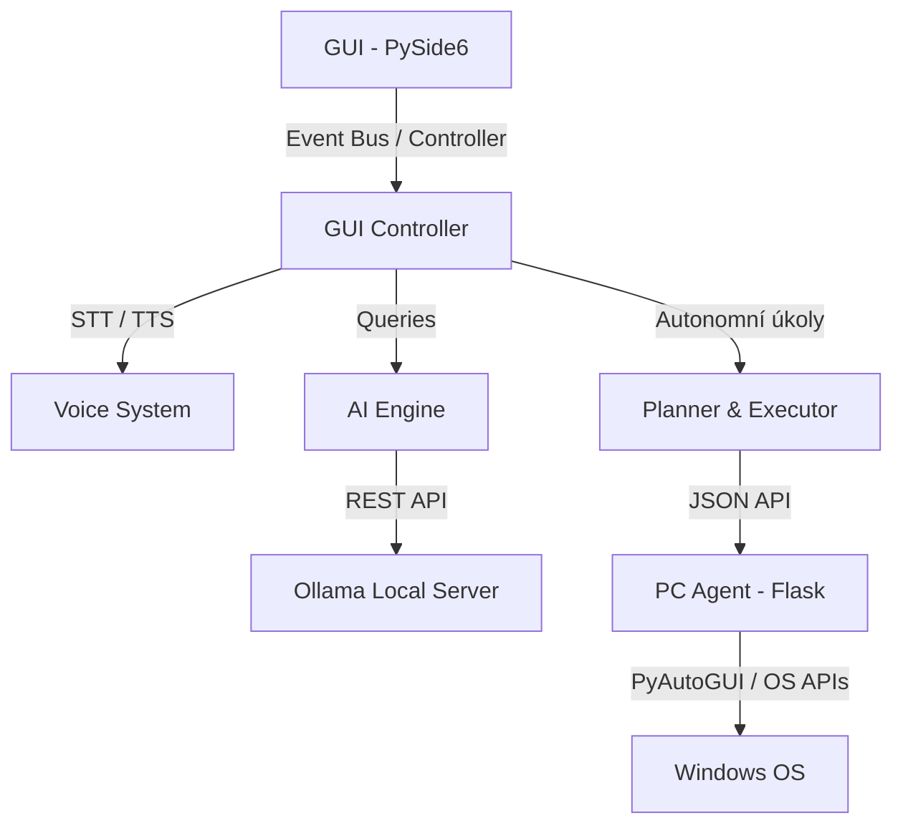

# Jarvis

Místní a autonomní AI asistent pro operační systém Windows s podporou hlasového ovládání v češtině.

## Description

Jarvis je modulární, plně lokálně běžící AI asistent navržený speciálně pro Windows. Kombinuje desktopovou aplikaci v PySide6 (Qt) pro interaktivní chat, hlasový vstup a výstup s autonomním agentem běžícím na pozadí, který dokáže přímo ovládat systém (psát text, klikat myší, otevírat weby a aplikace, provádět OCR analýzu obrazovky atd.). Jarvis je navržen s ohledem na bezpečnost a soukromí – veškeré výpočty (LLM, rozpoznávání hlasu, syntéza řeči) probíhají lokálně na vašem PC bez odesílání dat do cloudu.

## Features

- **Lokální LLM Backend:** Propojení s frameworkem Ollama (podpora modelů jako Llama 3, Mistral atd.).
- **Multi-model Strategie:** Různé režimy odezvy (`fast`, `balanced`, `precise`) využívající specifické modely podle náročnosti úlohy.
- **Kompletní Hlasový Systém:** Hlasový vstup v češtině přes `faster-whisper`, lokální český hlasový výstup přes `piper-tts` (model `cs_CZ-jirka-medium.onnx`) a offline detekce Wake Wordu ("jarvis").
- **Windows PC Control Agent:** Lokální Flask server vykonávající akce v OS Windows.
- **Vision & OCR Systém:** Snímání obrazovky a lokalizace prvků pomocí OCR (Tesseract) a lokálního vision LLM.
- **Autonomní Plánování:** Překlad komplexních příkazů ("otevři Chrome a vyhledej recept na pizzu") na posloupnost spustitelných nástrojů.

## Architecture

Jarvis je rozdělen do několika vrstev, které spolu komunikují lokálně přes Event Bus a HTTP:

1. **GUI (PySide6):** Uživatelské rozhraní chatu, vizualizace orbů a nastavení.
2. **GUI Controller:** Propojuje grafické rozhraní se službami AI, pamětí a hlasem.
3. **AI Engine & Routing:** Komunikuje s Ollama a směruje dotazy na příslušný model na základě typu požadavku.
4. **Voice System:** Zajišťuje nízkoúrovňové nahrávání mikrofonu, detekci řeči (VAD), přepis (STT) a syntézu (TTS).
5. **PC Agent (Flask):** Izolovaná služba na pozadí, která přijímá příkazy k ovládání Windows rozhraní (klávesnice, myš, spouštění procesů).
6. **Planner & Executor:** Autonomní smyčka, která analyzuje požadavky a sestavuje plán nástrojů pro dosažení cíle.



## Project Structure

Projekt se skládá z následujících hlavních modulů:

- **`app/`**: Vstupní body aplikace.
  - [main.py](file:///c:/Users/Kreca/Pictures/AI/app/main.py) – Hlavní orchestrátor spouštějící Ollama, Flask agenta a GUI.
  - [gui.py](file:///c:/Users/Kreca/Pictures/AI/app/gui.py) – Spouštěč pouze pro uživatelské rozhraní.
- **`interfaces/`**: Uživatelská rozhraní.
  - [gui/](file:///c:/Users/Kreca/Pictures/AI/interfaces/gui) – PySide6 komponenty, widgety a styly.
  - [voice.py](file:///c:/Users/Kreca/Pictures/AI/interfaces/voice.py) – Abstrace hlasových služeb.
- **`ai/`**: Logika AI a strategické směrování.
  - [engine.py](file:///c:/Users/Kreca/Pictures/AI/ai/engine.py) – Směrování požadavků a komunikace s lokálními LLM.
- **`core/`**: Jádro agenta.
  - [agent.py](file:///c:/Users/Kreca/Pictures/AI/core/agent.py) – Flask server vykonávající akce v systému.
  - [planner.py](file:///c:/Users/Kreca/Pictures/AI/core/planner.py) & [executor.py](file:///c:/Users/Kreca/Pictures/AI/core/executor.py) – Rozpad úkolů a provádění nástrojů.
- **`tools/`**: Nástroje pro ovládání PC a správu souborů.
- **`services/`**: API klienti.
- **`Voice/`**: Nízkoúrovňová audio pipeline (VAD, Piper, Whisper).
- **`vision/`**: Analýza obrazovky a OCR.
- **`tests/`**: Unit a integrační testy.

## Installation

### Requirements

Před spuštěním se ujistěte, že máte na svém systému Windows nainstalováno:
1. **Python 3.11** (doporučeno)
2. **Ollama** (stažení z [ollama.com](https://ollama.com))
3. **Tesseract OCR** (instalováno do `C:\Program Files\Tesseract-OCR\`)

### Postup instalace:

1. **Klonování projektu:**
   ```powershell
   git clone https://github.com/vas-username/jarvis.git
   cd jarvis
   ```

2. **Vytvoření virtuálního prostředí a instalace:**
   Projekt obsahuje automatický opravný skript. Spusťte dvojklikem:
   ```powershell
   .\Repair Environment.bat
   ```
   Tento skript vytvoří složku `.venv`, zaktualizuje `pip` a nainstaluje veškeré závislosti ze souboru [requirements.txt](file:///c:/Users/Kreca/Pictures/AI/requirements.txt).

3. **Nastavení konfigurace:**
   Zkopírujte vzorový soubor `.env.example` do `.env`:
   ```powershell
   copy .env.example .env
   ```
   *(Případně doplňte PICOVOICE_ACCESS_KEY pro wake word, pokud nepoužíváte RMS fallback).*

## Voice System

Hlasový systém funguje plně offline a obsahuje tři hlavní části:
- **Wake Word Detection:** Poslouchá na klíčové slovo *"jarvis"* přes Picovoice Porcupine (vyžaduje přístupový klíč v `.env`) nebo RMS energetický fallback.
- **Speech-to-Text (STT):** Využívá knihovnu `faster-whisper` pro vysoce přesný přepis české řeči na pozadí.
- **Text-to-Speech (TTS):** Využívá open-source model **Piper TTS** s českým hlasem Jirka (`cs_CZ-jirka-medium.onnx`). Tento model je z licenčních a velikostních důvodů vyloučen z Git repozitáře a stahuje se lokálně.

## Vision System

Systém Vision umožňuje Jarvisovi "vidět" vaši obrazovku:
- Pořizuje lokální snímky obrazovky do složky `screenshots/` (která je ignorována v Git).
- Využívá OCR knihovnu **Tesseract OCR** pro čtení textů z obrazovky, což umožňuje přesnou lokalizaci a klikání na textové prvky (např. tlačítka).
- Dokáže předat snímek lokálnímu vision modelu přes Ollama pro komplexnější vizuální analýzu.

## Planner

Planner slouží k rozpadu obecného požadavku uživatele na sekvenci kroků:
- Přijme textový příkaz a analyzuje, zda ho lze splnit přímo.
- Pokud ne, vytvoří strukturovaný plán složený z dostupných systémových nástrojů.
- Monitoruje průběh plnění a reaguje na případné chyby pomocí rety a fallback mechanismů.

## PC Control

Vlastní prováděcí vrstva využívá lokální Flask API (`core/agent.py`) a umožňuje Jarvisovi:
- Klikání na souřadnice nebo detekované vizuální prvky.
- Simulaci stisků kláves a psaní textu přes `pyautogui`.
- Vyhledávání a spouštění nainstalovaných aplikací na základě registru a systémových cest Windows.
- Otevírání specifických webových stránek v defaultním prohlížeči.

## Running Jarvis

Pro běžné spuštění aplikace s GUI dvakrát klikněte na:
```powershell
.\Start Jarvis.bat
```

Pro spuštění autonomního plánovače a exekuce z příkazové řádky (CLI):
```powershell
python run.py "otevri chrome a napis ahoj"
```

Chcete-li spustit pouze plán bez exekuce (dry-run):
```powershell
python run.py --dry-run "otevri chrome"
```

## Roadmap

- [ ] Přechod na novější verzi PySide a vylepšení animací UI orbu.
- [ ] Vylepšení přesnosti OCR detekce a lokalizace menších UI prvků.
- [ ] Doplnění integrace pro lokální Llama 3 Vision modely v základu.
- [ ] Optimalizace spouštění modelů a snížení RAM/VRAM footprintu na slabších GPU.

## License

Tento projekt je licencován pod licenci MIT. Detaily naleznete v přiloženém souboru LICENSE (pokud je přítomen).

## Contributing

Příspěvky do projektu jsou vítány! Při přispívání prosím dodržujte následující pravidla:
1. Vytvořte si vlastní fork projektu a pracujte ve feature branchi.
2. Před odesláním Pull Requestu se ujistěte, že všechny testy procházejí úspěšně spuštěním:
   ```powershell
   python -m unittest discover -s tests
   ```
3. Udržujte čistý kód a pište dokumentaci pro všechny nové funkce.
