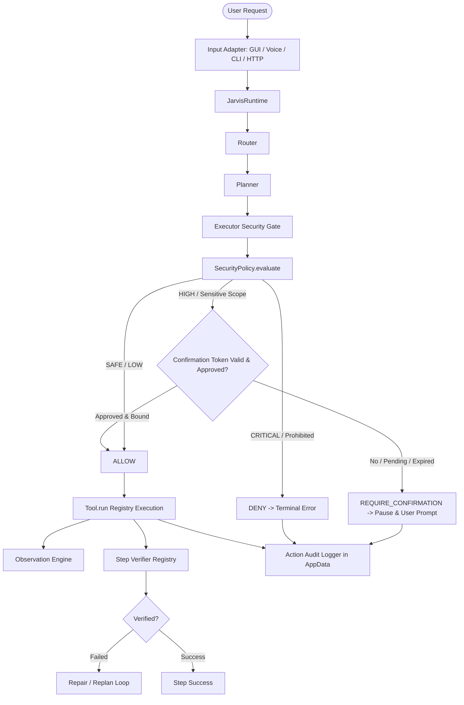

# Jarvis Security Architecture & Action Authorization Kernel

## 1. Overview & Core Philosophy

Jarvis operates as a local Windows AI assistant capable of interacting with the operating system, file system, UI elements, and local processes. To ensure absolute safety, Jarvis follows a strict **Fail-Closed, Zero-Implicit-Trust** authorization model:

1. **Security Precedes Execution:** Authorization checks occur *before* tool execution.
2. **Verification Follows Execution:** Ground-truth world verification occurs *after* execution.
3. **No LLM in the Security Gate:** Security decisions are 100% deterministic, based on capability classification, hierarchical risk ratings, target resource scopes, and cryptographic/unique confirmation tokens.
4. **Unified Across All Ingresses:** GUI, Voice, CLI, and HTTP (`/task`, `/command`) pass through the exact same Security Policy Engine.
5. **Fail-Closed:** Missing security metadata, unknown tools, or expired confirmations automatically result in `DENY` or `REQUIRE_CONFIRMATION`.



---

## 2. Action Risk Hierarchy

Jarvis defines a strict integer-ordered hierarchy of action risks:

```python
class ActionRisk(IntEnum):
    SAFE = 10      # Zero or negligible impact (read clock, list dir, calculate)
    LOW = 20       # Normal read/launch operations (open browser, harmless apps)
    MEDIUM = 30    # User state modifications (writing user files, typing into UI)
    HIGH = 40      # Potentially destructive operations (delete, close window, shell)
    CRITICAL = 50  # Prohibited system destructions (formatting, system32 mods)
```

**Order Invariant:** `SAFE < LOW < MEDIUM < HIGH < CRITICAL`.

---

## 3. Tool Capabilities

Every tool registered in `ToolRegistry` declares an explicit `ToolCapability`:

- **Applications & Processes:** `LAUNCH_APPLICATION`, `PROCESS_START`, `PROCESS_TERMINATE`, `SHELL_COMMAND`, `SYSTEM_QUERY`
- **Files & Directories:** `READ_FILE`, `CREATE_FILE`, `MODIFY_FILE`, `DELETE_FILE`, `CREATE_DIRECTORY`, `DELETE_DIRECTORY`
- **Browser & Network:** `OPEN_URL`, `NAVIGATE`, `DOWNLOAD`
- **User Interface:** `TYPE_TEXT`, `PRESS_KEY`, `CLICK`, `DOUBLE_CLICK`, `SCREEN_OBSERVATION`, `UI_CLICK`
- **Media:** `AUDIO_PLAYBACK`
- **Fallback:** `UNKNOWN`

If a tool does not provide capability metadata and is unrecognized, `ToolRegistry` and `SecurityPolicy` treat it as `UNKNOWN` with `CRITICAL` risk, denying execution immediately.

---

## 4. Resource Scope Classification

Riziko operace se dynamicky vyhodnocuje podle cílového systémového zdroje (cesty, URL nebo procesu):

- `SYSTEM_PROTECTED`: `C:\Windows`, `System32`, `Program Files`, `ProgramData`, kořeny disků (`C:\`).
  - Úpravy nebo mazání v tomto scope jsou **vždy `CRITICAL` -> `DENY`**.
  - Čtení systémových souborů vyžaduje explicitní `REQUIRE_CONFIRMATION`.
- `USER_WORKSPACE`: Adresář aktivního projektu nebo pracovního prostoru. Běžné zápisy jsou povoleny nebo vyžadují potvrzení při přepisu.
- `USER_DOCUMENTS`: Uživatelský profil (`C:\Users\<User>\Documents`, `Desktop`).
- `APP_DATA`: Lokální konfigurační a paměťová data (`AppData\Roaming`, `AppData\Local`).
- `TEMPORARY`: Dočasné soubory (`%TEMP%`, `%TMP%`).
- `NETWORK_URL`: Bezpečné webové adresy.
- `UNKNOWN`: Neověřené nebo neobvyklé cesty. Zápis vyžaduje `REQUIRE_CONFIRMATION`.

---

## 5. Structured Confirmation Model & Expiration

Nahrazení dřívějšího boolean flagu `action_confirmed == True`:

### `ConfirmationRequest` Token
Každý požadavek na potvrzení je reprezentován objektem `ConfirmationRequest`:
- `request_id`: Unikátní identifikátor životního cyklu požadavku.
- `step_id`: Konkrétní index kroku v plánu (1-indexed).
- `tool`: Přesný název nástroje.
- `capability`: Příslušná schopnost.
- `risk`: Úroveň rizika.
- `resource`: Cílový prostředek (např. soubor, proces).
- `summary`: Konkrétní popis nebezpečí a důvodu.
- `created_at`: Unix timestamp vytvoření.
- `expires_at`: Čas expirace (výchozí TTL: 300 sekund / 5 minut).
- `status`: `PENDING` | `APPROVED` | `DENIED` | `EXPIRED`.

### Izolace mezi požadavky (No Cross-Request Leakage)
Tokeny jsou spravovány v thread-safe `ConfirmationManager`:
- Schválení pro `(Request A, Step 1, tool X)` **nikdy** nemůže autorizovat `(Request B, Step 1, tool Y)`.
- Při zrušení požadavku (`cancel_task` / `cancel_current_request`) jsou všechny nevyřízené tokeny daného `request_id` okamžitě zneplatněny (`DENIED`).
- Po expiraci TTL (`is_expired`) je token neplatný a akce se nespustí.

### Specifické zprávy pro uživatele
Zprávy nejsou vágní ("Potvrdit akci?"), nýbrž obsahují:
- Název nástroje a capability
- Cílový resource
- Úroveň rizika
- Důvod a varování před nevratností

---

## 6. Action Audit Logger & Secret Redaction

Všechny akce a bezpečnostní rozhodnutí jsou zaznamenávány v append-only JSONL žurnálu v `%APPDATA%\Jarvis\audit\action_audit.jsonl`:

### Zaznamenávané atributy:
- `timestamp`
- `request_id`
- `step_id`
- `source` (`gui`, `voice`, `cli`, `http`)
- `tool`
- `capability`
- `risk`
- `decision` (`ALLOW`, `REQUIRE_CONFIRMATION`, `DENY`)
- `confirmation_status` (`PENDING`, `APPROVED`, `DENIED`, `EXPIRED`)
- `execution_status` (`SUCCESS`, `FAILED`, `DENIED`, `PAUSED`, `CANCELLED`)
- `verification_status` (`VERIFIED`, `FAILED`, `NOT_APPLICABLE`, `UNKNOWN`)
- `resource`
- `error`

### Redakce tajemství (Secret Redaction)
Funkce `redact_secrets()` deterministicky maskuje citlivá data (hesla, tokeny, API klíče, autorizační hlavičky, cookies, private keys) před zápisem do žurnálu:
- Hodnoty citlivých klíčů jsou nahrazeny `[REDACTED]`.
- V textových řetězcích jsou regulárními výrazy maskována přiřazení typu `token=***`, `password=***`, `Bearer ***`.

---

## 7. HTTP Endpoints Security (`/task`, `/command`)

1. **Eliminace Bypassu `open_path`:**
   Dříve mohl `/command` s parametrem `open_path` spustit jakýkoliv proces přímo přes `os.startfile` nebo `subprocess.Popen`.
   Nyní je `open_path` v `core/agent.py` označen jako low-level a přímo podléhá `SecurityPolicy.evaluate()`. Pokusy o spuštění v systémovém scope (`System32`, `cmd.exe`, `powershell.exe`) jsou zamítnuty s HTTP 403 Forbidden.
2. **Local Loopback & Local Auth Token:**
   Endpointy přijímají požadavky pouze z lokálního loopback rozhraní (`127.0.0.1`, `::1`).
   Pokud je nastavena proměnná prostředí `JARVIS_LOCAL_TOKEN`, endpointy vyžadují hlavičku `X-Jarvis-Token`.
   Není zavedena žádná cloudová autentizace; Jarvis zůstává striktně lokální.

---

## 8. Fail-Closed Invariants

| Situace | Rozhodnutí Policy Engine |
| :--- | :--- |
| Nástroj není registrován v `ToolRegistry` | `DENY` -> `TERMINAL_ERROR` |
| Vstupní argumenty neodpovídají `input_schema` | `DENY` -> `TERMINAL_ERROR` |
| Akce nese riziko `CRITICAL` | `DENY` -> `TERMINAL_ERROR` |
| Pokus o úpravu systémové cesty (`C:\Windows\...`) | `DENY` -> `TERMINAL_ERROR` |
| Akce nese riziko `HIGH` | `REQUIRE_CONFIRMATION` |
| Confirmation token vypršel (TTL > 300s) | `EXPIRED` -> `DENIED` -> `TERMINAL_ERROR` |
| Confirmation token patří jinému `request_id` | `DENIED` (mismatch error) |
| Uživatel zrušil operaci | `CANCELLED` (tokeny okamžitě invalidovány) |
